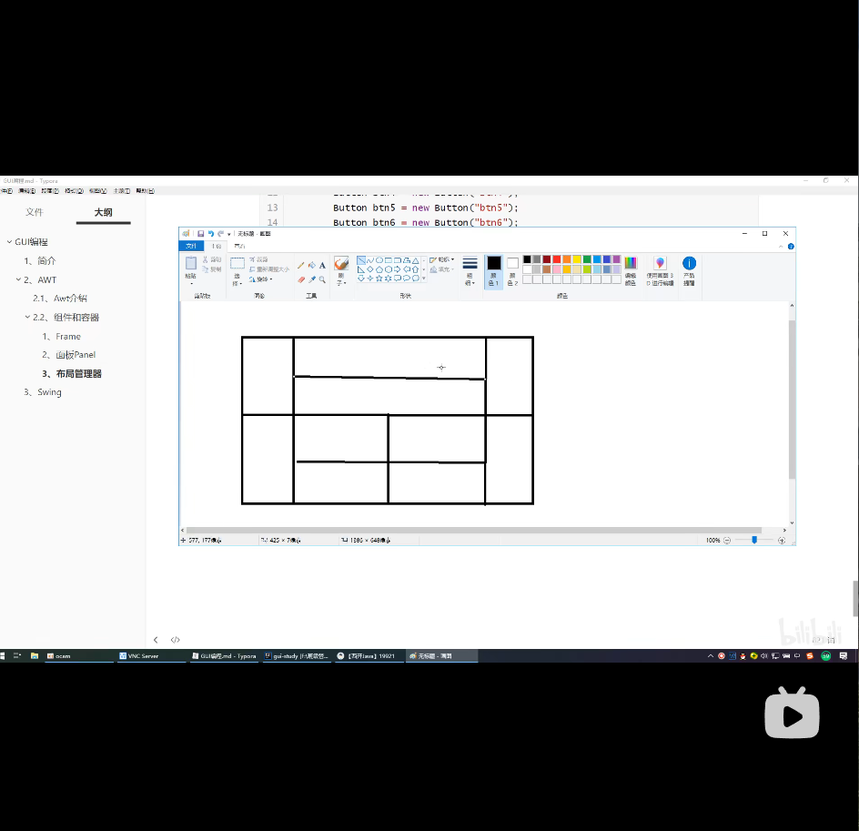

# GUI编程
如何学习？
- 这是什么
- 它怎么玩
- 该如何去在我们平时运用
## 第一.组件
- 窗口
- 弹窗
- 面板
- 文本框dos
- 列表框
- 按钮
- 图片
- 交互
- 监听事件
- 鼠标
- 键盘事件
- 外挂
## 1.简介
GUI核心技术：Swing 丶 AWT
### 缺点
一丶因为界面不美观;
二丶需要jre环境 
### 优点
1.为什么我们要学习？
- 可以写出自己心中的一些小工具
- 工作时候，也可能需要维护到Swing界面，概率小
- 了解MVC架构，了解监听!

## 第二
### 2.1 AWT介绍
1. 包含了很多类和接口！GUI：图形用户界面编程
2. 元素：窗口丶按钮丶文本框
3. java.lang;java.awt;在lib中，放了很多jar包
4. 组件Component；
组件：
- button,TextArea,Label都会添加到容器中
- 容器Container包含（window["Frame", "Dialog"], 面板Panel["Applet"]）

**关闭事件的解决**
```aidl
import java.awt.*;
import java.awt.event.WindowAdapter;
import java.awt.event.WindowEvent;
import java.awt.event.WindowListener;

// Panel 可以看成是一个空间,但是不能单独存在
public class TestPanel {
    public static void main(String[] args) {
        Frame frame = new Frame();
        // 布局的概念
        Panel panel = new Panel();

        //设置布局
        frame.setLayout(null);

        // 初始坐标
        frame.setBounds(300,300,500,500);
        frame.setBackground(new Color(40,161, 35));

        // panel 设置坐标,相对于frame
        panel.setBounds(50,50,400,400);
        panel.setBackground(new Color(0xC20303));

        // frame.add(panel)
        frame.add(panel);

        frame.setVisible(true);

        // 监听事件, 监听窗口关闭事件
        // 适配器模式: 就是写其中的某一种父类方法进行重写
        // 一种是WindowListener这种模式，是直接去重写所有父类的方法
        frame.addWindowListener(new WindowAdapter() {
            // 窗口关闭所需要做的事情
            @Override
            public void windowClosing(WindowEvent e) {
                System.exit(0); // 0是正常退出，1是有异常的退出
            }
        });
    }
}
```
*关闭图片*

# 布局管理
- 流式布局
- 东南西北中（页面布局）
- 表格布局 Grid

**练习题1**


```aidl
package ex01;

import java.awt.*;
import java.awt.event.WindowAdapter;
import java.awt.event.WindowEvent;

public class TestLayoutResult {
    public static void main(String[] args) {
        // 总
        Frame frame = new Frame("TestLayoutResult");
        frame.setLocation(500,400);
        frame.setSize(700,500);
        frame.setBackground(Color.black);
        frame.setVisible(true);
        frame.setLayout(new GridLayout(2,1));

        // 4个面板
        Panel p1 = new Panel(new BorderLayout());
        Panel p2 = new Panel(new GridLayout(2,1));
        Panel p3= new Panel(new BorderLayout());
        Panel p4 = new Panel(new GridLayout(2,2));

        p1.add(new Button("West-1"),BorderLayout.WEST);
        p1.add(new Button("East-1"),BorderLayout.EAST);
        p2.add(new Button("p2-btn-1"));
        p2.add(new Button("p2-btn-2"));
        p1.add(p2,BorderLayout.CENTER);

        p3.add(new Button("West-2"),BorderLayout.WEST);
        p3.add(new Button("East-2"),BorderLayout.EAST);
        for (int i = 0; i < 4; i++) {
            p4.add(new Button("for-"+i));
        }
        p3.add(p4, BorderLayout.CENTER);

        frame.add(p1);
        frame.add(p3);

        // 关闭这个窗口
        frame.addWindowListener(new WindowAdapter() {
            @Override
            public void windowClosing(WindowEvent e) {
                System.exit(0);
            }
        });

    }
}
```
## 总结
1. Frame是一个顶级窗口
2. Panel无法单独显示，必须添加到某个容器中

# 事件监听
- 多个按钮共享一个事件
```aidl
package lesson02;

import java.awt.*;
import java.awt.event.ActionEvent;
import java.awt.event.ActionListener;

// 多个按钮共享一个事件
public class TestActionTwo {
    public static void main(String[] args) {
        // 两个按钮，实现同一个监听
        // 开始 停止
        Frame frame = new Frame("开始-停止");

        Button button1 = new Button("start");
        Button button2 = new Button("stop");

        // 可以显示的定义触发返回的命令，如果不显示定义，则会走默认
        button2.setActionCommand("button2-stop");

        MyMonitor myMonitor = new MyMonitor();
        button1.addActionListener(myMonitor);
        button2.addActionListener(myMonitor);

        frame.add(button1, BorderLayout.NORTH);
        frame.add(button2, BorderLayout.SOUTH);
        frame.pack();
        frame.setVisible(true);

    }
}


class MyMonitor implements ActionListener {

    @Override
    public void actionPerformed(ActionEvent e) {
        // 获取按钮的信息
        System.out.println("按钮被点击了"+e.getActionCommand());
    }
}
```
## 计算器
1. 输入框TextField监听
2. 