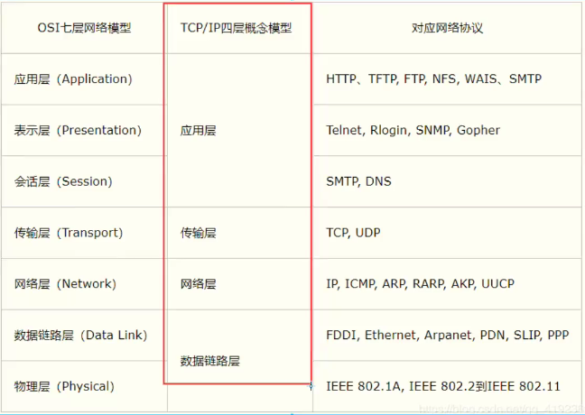

# 网络编程
## 网络通信的要素
- 如何实现网络的通信？
    - ip
    - 端口号
    - 192.168.16.124:9892

  **规则：**
    - 网络模型分七层
    - 小结：
        - 网络编程中有两个主要问题
        - 如何准确的定位到网络上的一台或者多台主机
        - 找到主机如何进行通信

## ip
ip地址：InetAddress
- 唯一定位一台网络计算机（mac）
- 127.0.0.1:本机localhost
- ip地址的分类
    - ipv4/ipv6
        - IPV4 42亿
        - IPv6 fe80::f4f0:c6e4:b68se:9020%5s,128位,8个无符号证书
    - 公网-私网
        - 公网： ABCD类地址
        - 192.168.x.x ,专门给组织能不使用的
- 域名：记忆IP问题
    - ip: www.vip.com 万网
## 端口
- 一个端口表示程序的进程
  - 不同的进程有不同的端口号！用来区分软件
  - 被规定0-65535
  - TCP,UDP 65535*2 tcp:80 单个协议下端口不能冲突
  - 端口分类
    - 共有端口：0-1023
    - HTTP:80
    - HTTPS： 443
    - FTP： 21
    - Telet： 23
  程序注册端口： 1024-49151，分配各用户和程序
    - Tomcat： 8080
    - Mysql：3306
    - Oracle： 1521

**端口映射：**
一个程序比如QQ，和另一台主机的QQ，那么
主机1 QQ的端口1231，那么另一台主机的QQ端口2321
这两个端口可以进行通信

**通信协议：**
1. 协议：约定
2. 速率，传输速率，代码结构，传输控制
3. TCP、IP协议簇
    - 用户传输协议
    - 用户数据报协议
   TCP/IP:
    - 一组协议


*TCP：*
- 连接，稳定
- 三次握手，4次挥手
- 客户端，服务端

*UDP：*
- 不进行连接，不稳定
- 客户端，服务端：没有明确的界限
- 不管是否准备好，都可以发给你
- DDOS: 洪水攻击

### TCP
**客户端**
1. 连接服务器 Socket
2. 发送消息
```aidl
package com.wangjie.lesson02;

import java.io.IOException;
import java.io.OutputStream;
import java.net.InetAddress;
import java.net.Socket;
import java.net.UnknownHostException;

// 客户端
public class TcpClientDemo01 {

    public static void main(String[] args) {
        //1.要知道服务器地址
        Socket socket = null;
        OutputStream os = null;

        {
            try {
                InetAddress serverIP = InetAddress.getByName("127.0.0.1");
                // 2.端口号
                int port = 9999;
                // 3.创建一个socket连接
                socket = new Socket(serverIP,port);
                // 发送IO流
                os = socket.getOutputStream();

                os.write("你好兄弟,java狂神牛皮".getBytes());

            } catch (IOException e) {
                e.printStackTrace();
            }finally {
                if (os != null){
                    try {
                        os.close();
                    } catch (IOException e) {
                        e.printStackTrace();
                    }
                }
                if (socket != null){
                    try {
                        socket.close();
                    } catch (IOException e) {
                        e.printStackTrace();
                    }
                }
            }
        }
    }
}

```

**服务器**
1. 建立服务端口ServerSocket
2. 等待用户的连接accept
3. 接收用户的消息

```aidl
package com.wangjie.lesson02;

import java.io.ByteArrayInputStream;
import java.io.ByteArrayOutputStream;
import java.io.IOException;
import java.io.InputStream;
import java.net.InetAddress;
import java.net.ServerSocket;
import java.net.Socket;

// 服务端
public class TcpServerDemo01 {
    public static void main(String[] args) {
        // 放在这里就是提升作用域
        ServerSocket serverSocket = null;
        Socket socket = null;
        InputStream is = null;
        ByteArrayOutputStream baos = null;

        // 有服务器地址
        try {
            serverSocket = new ServerSocket(9999);

            while (true){
                // 等待客户端连接过来
                socket = serverSocket.accept();
                // 读取客户端的消息
                is = socket.getInputStream();

                // 管道流
                baos = new ByteArrayOutputStream();
                byte[] buffer = new byte[1024];
                int len;
                while ((len=is.read(buffer))!=-1) {
                    baos.write(buffer,0,len);
                }
                System.out.println(baos.toString());
            }


        } catch (IOException e) {
            e.printStackTrace();
        } finally {
            // 关闭资源
            if (baos != null){
                try {
                    baos.close();
                } catch (IOException e) {
                    e.printStackTrace();
                }
            }
            if (is != null) {
                try {
                    is.close();
                } catch (IOException e) {
                    e.printStackTrace();
                }
            }
            if (socket != null) {
                try {
                    socket.close();
                } catch (IOException e) {
                    e.printStackTrace();
                }
            }
            if (serverSocket != null) {
                try {
                    serverSocket.close();
                } catch (IOException e) {
                    e.printStackTrace();
                }
            }

        }
    }
}

```