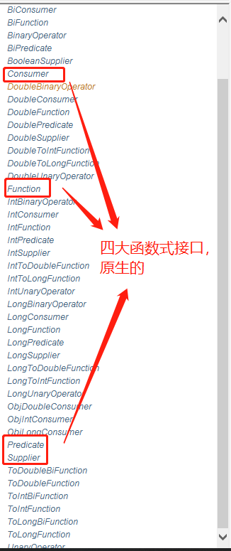
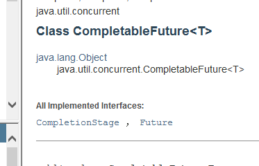

### 1.什么是JUC
就是java下的三个包
- java.util.concurrent
- java.util.concurrent.automic
- java.util.concurrent.Locks

**源码+官方文档**
面试高频问!

java.util工具包丶包丶类

**业务：普通的线程代码**
Runnable 没有返回值丶效率相比Callable相对比较低;
Java默认有几个线程？
2个
- main
- GC垃圾回收线程

线程：开了一个进程Typora，写字， 自动保存（线程负责的）

***Java可以开启线程吗？***
开不了的，java无法操作硬件

---
**并发和并行是什么？**
并发（多线程操作同一个资源）
- CPU一核，模拟出多条线程，天下武功，无快不破，快速交替

**并行（多个人一起行走）**,线程池

>线程有几个状态
```
public enum State {
        // 新生
        NEW,
        // 运行
        RUNNABLE,
        // 阻塞
        BLOCKED,
        // 等待,一直等，等到死
        WAITING,
        // 超时等待
        TIMED_WAITING,
        // 终止
        TERMINATED;
    }
```

>wait/sleep

1丶来自不同的类
wait => Object
sleep => Thread
**2丶关于锁的释放**
wait会释放锁，sleep不会释放锁
**3丶使用的范围是不同的**

wait
>wait必须在同步代码块中

sleep
>可以在任何地方睡觉

**4丶是否需要捕获异常**

wait
>不需要捕获异常

sleep
>必须要捕获异常

### 2.Lock（重点）

>传统Synchronized

>Lock

实现类：ReentrantLock， ReentrantReadWriteLock.ReadLock， ReentrantReadWriteLock.WriteLock
可重入锁(最常用的);


- 公平锁:十分公平，可以先来后到 
- 非公平锁：十分不公平，可以插队（默认）

```
package com.wangjie;
import java.util.TreeMap;
import java.util.concurrent.locks.Lock;
import java.util.concurrent.locks.ReentrantLock;

public class SaleTicketDemo02 {
    public static void main(String[] args) {
        // 并发：多个线程操作一个资源类
        Ticket2 ticket = new Ticket2();
        new Thread(() -> {for (int i = 1;i< 40; i++) ticket.sale();}, "A").start();
        new Thread(() -> {for (int i = 1;i< 40; i++) ticket.sale();}, "B").start();
        new Thread(() -> {for (int i = 1;i< 40; i++) ticket.sale();}, "C").start();
    }
}

// Lock,三部曲
// 1.new ReentrantLock();
// 2.lock.lock();
// 3.finally => Lock.unlock(); // 解锁
class Ticket2 {
    // 属性和方法
    private int number = 30;

    Lock lock = new ReentrantLock();


    // 买票方式及, 不使用synchronized
    public void sale(){

        lock.lock(); // 加锁

        try {
            // 业务代码
            if (number>0){
                System.out.println(Thread.currentThread().getName()+"卖出了"+(number-- + "票，剩余票"+number));
            }
        } catch (Exception e) {
            e.printStackTrace();
        } finally {
            lock.unlock(); // 解锁
        }
    }
}
```

>Synchronized和Lock区别

1. Synchronized 是内置的关键字，Lock是一个Java类
2. Synchronized 无法判断锁的状态， Lock是可以判断是否获取到了锁
3. Synchronized 会自动释放锁（a》b）， lock必须要手动释放锁,死锁
4. Synchronized 线程1（获得锁），线程2（等待，傻傻的等）;Lock锁就不一定一直等待下去了；
5. Synchronized 可重入锁，不可以中断的，非公平的；Lock，可重入锁，可以判断锁，默认非公平的（可以自己设置）;
6. Synchronized 使用锁少量的代码同步问题，Lock锁适合锁大量的同步代码；

>锁是什么？如何判断锁的是谁？

### 3.生产者和消费者问题
面试题：
1.
Synchronized wait notify（老版）
Juc lock await signal
>大有门道

### 4.JUC版生产者和消费者
通过Lock找到Condition
Lock替换sychronized方法和语句的使用，Condition取代l对象监视器方法的使用。

```
package com.wangjie;

import java.util.concurrent.locks.Condition;
import java.util.concurrent.locks.Lock;
import java.util.concurrent.locks.ReentrantLock;

public class ProductComtumeB {
    public static void main(String[] args) {
        Data2 data = new Data2();

        new Thread(() -> {
            for (int i = 0; i < 10; i++) {
                try {
                    data.increment();
                } catch (InterruptedException e) {
                    e.printStackTrace();
                }
            }
        }, "A").start();
        new Thread(() -> {
            for (int i = 0; i < 10; i++) {
                try {
                    data.decrement();
                } catch (InterruptedException e) {
                    e.printStackTrace();
                }
            }
        }, "B").start();

        new Thread(() -> {
            for (int i = 0; i < 10; i++) {
                try {
                    data.increment();
                } catch (InterruptedException e) {
                    e.printStackTrace();
                }
            }
        }, "C").start();
        new Thread(() -> {
            for (int i = 0; i < 10; i++) {
                try {
                    data.decrement();
                } catch (InterruptedException e) {
                    e.printStackTrace();
                }
            }
        }, "D").start();
    }
}

// 等待，业务， 通知
class Data2 {
    //数字
    private int number = 0;

    Lock lock = new ReentrantLock();
    Condition condition = lock.newCondition();

//    condition.await(); // 等待
//    condition.signalAll(); // 唤醒全部

    //+1
    public void increment() throws InterruptedException {
        lock.lock();
        try {
            // 业务代码
            while (number!=0){
                // 等待
                condition.await();
            }
            number++;
            System.out.println(Thread.currentThread().getName()+"=>"+number);
            // 通知其他线程，+1完毕了
            condition.signalAll(); // 唤醒全部
        } catch (Exception e) {
            e.printStackTrace();
        } finally {
            lock.unlock();
        }
    }
    //-1
    public void decrement() throws InterruptedException {
        lock.lock();
        try {
            // 业务代码
            while (number==0){
                // 等待
                condition.await();
            }
            number--;
            System.out.println(Thread.currentThread().getName()+"=>"+number);
            // 通知其他线程，-1完毕了
            condition.signalAll(); // 唤醒全部
        } catch (Exception e) {
            e.printStackTrace();
        } finally {
            lock.unlock();
        }
    }
}
```
**任何一个新的技术，绝对不是仅仅只是覆盖了原来的技术，绝对有优势和补充！**
>Condition

优势是什么？


代码测试:
```
package com.wangjie;

import java.util.concurrent.locks.Condition;
import java.util.concurrent.locks.Lock;
import java.util.concurrent.locks.ReentrantLock;

/**
 * A 执行完调用B， B执行完调用C，C执行完调用D，D执行完调用A
 */

public class ProductComtumeC {
    public static void main(String[] args) {
        Data3 data3 = new Data3();

        new Thread(() -> {
            for (int i = 0; i < 10; i++) {
                try {
                    data3.printA();
                } catch (InterruptedException e) {
                    e.printStackTrace();
                }
            }
        }, "A").start();
        new Thread(() -> {
            for (int i = 0; i < 10; i++) {
                try {
                    data3.printB();
                } catch (InterruptedException e) {
                    e.printStackTrace();
                }
            }
        }, "B").start();
        new Thread(() -> {
            for (int i = 0; i < 10; i++) {
                try {
                    data3.printC();
                } catch (InterruptedException e) {
                    e.printStackTrace();
                }
            }
        }, "C").start();
        new Thread(() -> {
            for (int i = 0; i < 10; i++) {
                try {
                    data3.printD();
                } catch (InterruptedException e) {
                    e.printStackTrace();
                }
            }
        }, "D").start();
    }
}

class Data3 { // 资源类
    private Lock lock = new ReentrantLock();
    private Condition condition1 = lock.newCondition();
    private Condition condition2 = lock.newCondition();
    private Condition condition3 = lock.newCondition();
    private Condition condition4 = lock.newCondition();
    private int number = 1; // 1A 2B 3C 4D
    public void printA() throws InterruptedException {
        lock.lock();
        try {
            // 业务代码, 判断-》执行-》通知
            while (number != 1) {
                // 等待
                condition1.await();
            }
            System.out.println(Thread.currentThread().getName()+"=>AAAAAAA");
            // 唤醒指定的人，唤醒B, condition2
            number = 2; // 精准唤醒
            condition2.signal();

        } catch (Exception e) {
            e.printStackTrace();
        } finally {
            lock.unlock();
        }
    }
    public void printB() throws InterruptedException {
        lock.lock();
        try {
            // 业务代码
            while (number != 2) {
                // 等待
                condition2.await();
            }
            System.out.println(Thread.currentThread().getName()+"=>BBBBBBB");
            // 唤醒指定的人，唤醒C ，condition3
            number = 3; // 精准唤醒
            condition3.signal();

        } catch (Exception e) {
            e.printStackTrace();
        } finally {
            lock.unlock();
        }
    }
    public void printC() throws InterruptedException {
        lock.lock();
        try {
            // 业务代码
            while (number != 3) {
                // 等待
                condition3.await();
            }
            System.out.println(Thread.currentThread().getName()+"=>CCCCCCC");
            // 唤醒指定的人，唤醒D，condition4
            number = 4; // 精准唤醒
            condition4.signal();

        } catch (Exception e) {
            e.printStackTrace();
        } finally {
            lock.unlock();
        }
    }

    public void printD() throws InterruptedException {
        lock.lock();
        try {
            // 业务代码
            while (number != 4) {
                // 等待
                condition4.await();
            }
            System.out.println(Thread.currentThread().getName()+"=>DDDDDDD");
            // 唤醒指定的人，唤醒A，condition1
            number = 1; // 精准唤醒
            condition1.signal();

        } catch (Exception e) {
            e.printStackTrace();
        } finally {
            lock.unlock();
        }
    }
    // 生产线：下单 -》 支付- 》交易-》
}
```
---
**tips：**
1. 为什么在业务代码下我们等待不适用if，而是适用while？
- 问题存在A,B,C,D4个线程 ！ 虚假唤醒

---
### 5.八锁现象
---
如何判断锁的是谁？永远的知道什么锁？锁到底的锁的是谁？
对象丶Class
**深刻理解我们的锁**

> 小结

`new this`具体的一个手机
`static Class` 唯一的一个模板

### 6. 集合类不安全

> List不安全

问题和解决方案：
```
package com.unsafe;

import java.util.*;
import java.util.concurrent.CopyOnWriteArrayList;

// java.util.ConcurrentModificationException 并发修改异常！
public class ListTest {
    public static void main(String[] args) {
//        List<String> list = Arrays.asList("1", "2", "3", "4");
//        list.forEach(System.out::println);
        // 并发下 ArrayList 不安全的
        /**
         * 解决方案；
         * 1. 可以用Vector<>()解决
         * 2. 使用Collections.synchronizedList()包裹new ArrayList<>()这个
         * 3. CopyOnWriteArrayList这种方式去使用这个东西.
         */
//        List<String> list = new ArrayList<>();
//        List<String> list = new Vector<>();
//         List<String> list = Collections.synchronizedList(new ArrayList<>());
         // CopyOnWrite写入时复制 COW 计算机程序设计领域的一种优化策略;
         // 多线程调用的时候,list,读取的时候，固定的，写入（覆盖）
         // 在写入的时候避免覆盖,造成数据问题?
         // 读写分离
         // CopyOnWriteArrayList
         // CopyOnWriteArrayList 比 Vector的区别是什么？ 使用的是Lock，不是
         List<String> list = new CopyOnWriteArrayList<>();

         for (int i = 0; i < 10; i++) {
            new Thread(() -> {
                list.add(UUID.randomUUID().toString().substring(0,5));
                System.out.println(list);
            }, String.valueOf(i)).start();
        }
    }
}
```

> 狂神的学习方法推荐：1.先会用 2.货币三家，寻找其他的解决方案，3. 分析源码

> set不安全

解决的代码：
```
package com.unsafe;

import java.util.*;
import java.util.concurrent.CopyOnWriteArraySet;

/**
 * 同理可证：java.util.ConcurrentModificationException
 * 1. Collections.synchronizedSet()写法
 * 2. 还是CopyOnWriteArraySet<>()内容;
 */

public class SetTest {
    public static void main(String[] args) {
//        Set<String> set = new HashSet<>();
//        Set<String> set = Collections.synchronizedSet(new HashSet<>()); // 方法一
        Set<String> set = new CopyOnWriteArraySet<>();

        for (int i = 0; i < 30; i++) {
            new Thread(() -> {
                set.add(UUID.randomUUID().toString().substring(0, 5));
                System.out.println(set);
            }, String.valueOf(i)).start();
        }
    }
}
```
> HashMap的底层是什么？

```
public Hashset(){
    map = new HashMap<>();
    
    
}
// add set 本质是 map key是无法重复的!
public boolean add(E e){
    return map.put(e, PRESENT)==null;
}

private static final Object PRESENT = new Object(); // 不变的值
```

> Map不安全
> .....

### 7. callable

类似与Runnable;
1. 可以有返回值,
2. 可以抛出异常;
3. 方法不同 run()/ call()

代码演示:
```
package com.callabledemo;

import java.util.concurrent.Callable;
import java.util.concurrent.ExecutionException;
import java.util.concurrent.Future;
import java.util.concurrent.FutureTask;

/**
 * 1. 探究原理
 * 2. 觉得自己会用
 */

public class CallableTest {
    public static void main(String[] args) {
        // new Thread(new Runnable()).start();
        // new Thread(new FatureTask<V>).start();
        // new Thread(new FatureTask<V>(Callable)).start();


        MyThread thread = new MyThread();
        FutureTask task = new FutureTask(thread); // 适配类,找出Runnable()和Runnable之间的关系!

        new Thread(task, "A").start(); // 怎么启动Callable;
        new Thread(task, "B").start(); // 怎么启动Callable;

        // 获取Callable返回值
        try {
            Integer o = (Integer) task.get(); // 可能阻塞,假如这个获取这个返回值是一个耗时的操作就会阻塞
            System.out.println(o);
        } catch (InterruptedException e) {
            e.printStackTrace();
        } catch (ExecutionException e) {
            e.printStackTrace();
        }
    }
}

class MyThread implements Callable<Integer> {
    @Override
    public Integer call() {
        System.out.println("call()");
        return 1024;
    }
}
```
细节:
1. 有缓存
2. 结果可能需要等待;

### 8.常用JUC辅助类
>CountDownLatch, 减法计算器
```
package com.add;
import java.util.concurrent.CountDownLatch;
// 减法计算器
public class CountDownLatchDemo {
    public static void main(String[] args) throws InterruptedException {
        // 总数6,必须要执行任务才使用
        CountDownLatch countDownLatch = new CountDownLatch(6);
        for (int i = 0; i < 6; i++) {
            new Thread(() -> {
                System.out.println(Thread.currentThread().getName()+" Go out");
                countDownLatch.countDown();
            }, String.valueOf(i)).start();
        }
        countDownLatch.await(); // 等待计算器归零然后向下执行;
//        countDownLatch.countDown(); //-1
        System.out.println("Close Door");
    }
}

```
> CyclicBarrier, 加法计算器
```
package com.add;

import java.util.concurrent.BrokenBarrierException;
import java.util.concurrent.CyclicBarrier;

public class CyclicBarrierDemo {
    public static void main(String[] args) {
        CyclicBarrier cyclicBarrier = new CyclicBarrier(7, () -> {
            System.out.println("召唤神龙成功");
        });
        for (int i = 1; i <= 7; i++) {
            final int temp = i;
            new Thread(() -> {
                System.out.println(Thread.currentThread().getName()+"收集"+temp+"个龙珠");
                try {
                    cyclicBarrier.await();
                } catch (InterruptedException e) {
                    e.printStackTrace();
                } catch (BrokenBarrierException e) {
                    e.printStackTrace();
                }
            }).start();
        }
    }
}

```
> Semapphore, 通行证

```
package com.add;

import java.util.concurrent.Semaphore;
import java.util.concurrent.TimeUnit;

public class SemaphoreDemo {
    public static void main(String[] args) {
        Semaphore semaphore = new Semaphore(3);

        // 抢车位
        for (int i = 1; i <= 6; i++) {
            new Thread(() -> {
                try {
                    // 获取当前资源
                    semaphore.acquire();
                    System.out.println(Thread.currentThread().getName()+"抢到车位");
                    TimeUnit.SECONDS.sleep(2);
                    System.out.println(Thread.currentThread().getName()+"离开车位");
                } catch (InterruptedException e) {
                    e.printStackTrace();
                } finally {
                    // 释放当前资源
                    semaphore.release();
                }
            }, String.valueOf(i)).start();
        }
    }
}


```

### 9.读写锁
> ReadWriteLock

分为两把(一把写所,一把读所), 写所也叫独占锁.读所也叫共享锁
读-读  可以共存
读-写  不可共存
写-写  不可共存


### 10.阻塞队列
BlockingQueue不是新的东西,是阻塞队列
什么情况下使用:多线程,线程池

学会使用队列:
添加丶获取

>接着有4组API
```
1.执行完，抛出异常
2.有返回值，不会抛出异常
3.阻塞等待
4,超时等待
```

| 方式     | 抛出异常    | 不会抛出异常  | 阻塞等待   | 超时等待       |
| ------ | ------- | ------- | ------ | ---------- |
| 添加     | add     | offer() | put()  | offer()带参数 |
| 移除     | remove  | poll()  | take() | poll()带参数  |
| 判断队列首尾 | element | peek()  | -      | -          |


> 同步队列

没有容量。
进去一个元素，必须等待取出后再继续往里面放东西；
put,take

```
package com.queen;

import java.util.concurrent.BlockingQueue;
import java.util.concurrent.SynchronousQueue;
import java.util.concurrent.TimeUnit;

/**
 * 同步队列
 * 和其他的BlockQueue不一样，SynchronousQueue， 不存储元素
 * put一个元素，必须先里面先take取出来，否则不能在put值进去
 */

public class SynchronousQueueDemo {
    public static void main(String[] args) {
        BlockingQueue<String> blockingQueue = new SynchronousQueue();

        new Thread(() -> {
            try {
                System.out.println(Thread.currentThread().getName()+" put 1");
                blockingQueue.put("1");
                System.out.println(Thread.currentThread().getName()+" put 2");
                blockingQueue.put("2");
                System.out.println(Thread.currentThread().getName()+" put 3");
                blockingQueue.put("3");
            } catch (InterruptedException e) {
                e.printStackTrace();
            }
        }, "T1").start();

        new Thread(() -> {
            try {
                TimeUnit.SECONDS.sleep(2);
                System.out.println(Thread.currentThread().getName()+"取出"+blockingQueue.take());
                TimeUnit.SECONDS.sleep(2);
                System.out.println(Thread.currentThread().getName()+"取出"+blockingQueue.take());
                TimeUnit.SECONDS.sleep(2);
                System.out.println(Thread.currentThread().getName()+"取出"+blockingQueue.take());
            } catch (InterruptedException e) {
                e.printStackTrace();
            }

        }, "T2").start();
    }
}

```

### 11.线程池(重点)
线程池：三大方法丶7大参数丶4种拒绝策略
>池化技术

程序运行的本质，占用资源，优化资源优化！

线程池，连接池，内存池，对象池。。。// 创建丶销毁；十分浪费资源

池化技术：事先准备好一些资源，有人要用，就来我这里拿，用完之后还给我；

**线程池好处：**
1. 降低资源的消耗
2. 提高响应的速度
3. 方便管理

线程复用，可以控制最大并发数，管理线程

> 线程

线程池：三大方法丶7大参数丶4种拒绝策略

**三大方法**
```
package com.pool;


import java.util.concurrent.Executor;
import java.util.concurrent.ExecutorService;
import java.util.concurrent.Executors;

// Executors工具类
// 使用了线程池后，使用线程去创建
public class Demo01 {
    public static void main(String[] args) {
//        ExecutorService threadPool = Executors.newSingleThreadExecutor();// 单个线程
//        ExecutorService threadPool = Executors.newFixedThreadPool(5); // 创建一个固定的线程池的大小
        ExecutorService threadPool = Executors.newCachedThreadPool(); // 创建一个可伸缩的线程池大小

        try {
            for (int i = 0; i < 100; i++) {
                // 使用了线程池后，使用线程去创建
                threadPool.execute(() -> {
                    System.out.println(Thread.currentThread().getName()+" ok");
                });
            }
        } catch (Exception e) {
            e.printStackTrace();
        } finally {
            // 线程池用完，程序结束，关闭线程池
            threadPool.shutdown();
        }
    }
}

```

**7个参数**
源码分析
```
public static ExecutorService newSingleThreadExecutor() {
        return new FinalizableDelegatedExecutorService
            (new ThreadPoolExecutor(1, 1,
                                    0L, TimeUnit.MILLISECONDS,
                                    new LinkedBlockingQueue<Runnable>()));
    }
    
public static ExecutorService newFixedThreadPool(int nThreads) {
        return new ThreadPoolExecutor(nThreads, nThreads,
                                      0L, TimeUnit.MILLISECONDS,
                                      new LinkedBlockingQueue<Runnable>());
    }

public static ExecutorService newCachedThreadPool() {
        return new ThreadPoolExecutor(0, Integer.MAX_VALUE,
                                      60L, TimeUnit.SECONDS,
                                      new SynchronousQueue<Runnable>());
    }
本质：ThreadPoolExecutor()
```

**7个参数**
```
public ThreadPoolExecutor(int corePoolSize, // 核心线程池大小
                              int maximumPoolSize, // 最大线程池大小
                              long keepAliveTime, //超时没有人调用就释放
                              TimeUnit unit, //超时单位
                              BlockingQueue<Runnable> workQueue, //阻塞队列
                              ThreadFactory threadFactory, //线程工厂
                              RejectedExecutionHandler handler) { // 拒绝策略
        if (corePoolSize < 0 ||
            maximumPoolSize <= 0 ||
            maximumPoolSize < corePoolSize ||
            keepAliveTime < 0)
            throw new IllegalArgumentException();
        if (workQueue == null || threadFactory == null || handler == null)
            throw new NullPointerException();
        this.acc = System.getSecurityManager() == null ?
                null :
                AccessController.getContext();
        this.corePoolSize = corePoolSize;
        this.maximumPoolSize = maximumPoolSize;
        this.workQueue = workQueue;
        this.keepAliveTime = unit.toNanos(keepAliveTime);
        this.threadFactory = threadFactory;
        this.handler = handler;
    }
```

> 手动创建线程池

四种拒绝策略：


> 小结和拓展

池的最大大小如何去设置！
了解IO密集型丶CPU密集型；（调优）

### 12.四大函数式接口（必需掌握）
作用是：简化编程模型，在新版本的框架底层大量应用！
新时代的程序员：lambda表达式丶链式编程丶函数式接口丶Stream流式计算;
泛型丶枚举丶反射和注解，

> 函数式接口： 只有一个方法的接口

```
@FunctionalInterface
public interface Runnable {

    public abstract void run();
}
// 超级多FunctionalInterface
// 简化编程模型，在新版本中的框架大量运用
// foreach(消费者类型的函数式接口)
```


代码测试：

> Function

```
package com.function;

import java.util.function.Function;

/**
 * 函数型接口, 有一个输入参数，有一个输出
 *  只要是 函数型接口 可以用 lambda表达式简化
 */

public class Demo01 {
    public static void main(String[] args) {
        // 工具类：输出输入的值
//        Function function = new Function<String, String>() {
//            @Override
//            public String apply(String o) {
//                return o + "123";
//            }
//        };
        Function function = (str)->{return (str+"wangjie");};
        System.out.println(function.apply("asd"));

    }
}

```

> Consumer 消费型接口


代码测试：
```
package com.function;

import java.util.function.Consumer;

public class Demo03 {
    public static void main(String[] args) {
//        Consumer<String> consumer = new Consumer<String>() {
//            @Override
//            public void accept(String str) {
//                System.out.println(str);
//            }
//        };
        Consumer<String> consumer = (str) -> {System.out.println(str);};
        consumer.accept("adssds");
    }
}
```
> Supplier 供给型接口

代码测试：

```
package com.function;

import java.util.function.Supplier;

/**
 * Supplier 供给型接口 没有参数，只有返回值
 */

public class Demo04 {
    public static void main(String[] args) {
//        Supplier<Integer> supplier = new Supplier<Integer>() {
//            @Override
//            public Integer get() {
//                System.out.println("get");
//                return 1024;
//            }
//        };
        Supplier supplier = () -> {return 1024;};
        System.out.println(supplier.get());
    }
}

```

### stream流式计算
>什么是流式计算

大数据：存储+计算
存储：集合丶mysql

### 14.ForkJoin
> **分支合并：**

Fork/Join框架是Java 7提供的一个用于并行执行任务的框架， 核心思想就是把大任务分割成若干个小任务，最终汇总每个小任务结果后得到大任务结果，
其实现思想与MapReduce有异曲同工之妙。

> ForkJoin特点：工作窃取

这个里面维护的是双端队列；


代码测试：
```
package com.forkjoin;

import java.util.concurrent.ExecutionException;
import java.util.concurrent.ForkJoinPool;
import java.util.concurrent.ForkJoinTask;
import java.util.stream.LongStream;

public class Test {
    public static void main(String[] args) throws ExecutionException, InterruptedException {
//        test1(); // 4333ms
//        test2(); // 2922ms
        test3(); // 135ms


    }

    // 普通程序员
    public static void test1() {
        Long sum = 0L;
        long start = System.currentTimeMillis();
        for (Long i = 1L; i <= 10_0000_0000; i++) {
            sum += i;
        }

        long end = System.currentTimeMillis();
        System.out.println("sum="+ sum + "  时间: " + (end-start));
    }

    // 会使用forkjoin
    public static void test2() throws ExecutionException, InterruptedException {
        long start = System.currentTimeMillis();

        ForkJoinPool forkJoinPool = new ForkJoinPool();
        ForkJoinTask<Long> task1 = new ForkJoinDemo(0L, 10_0000_0000L);
        ForkJoinTask<Long> submit = forkJoinPool.submit(task1);// execute是同步执行，submit是异步提交；

        Long sum = submit.get();

        long end = System.currentTimeMillis();
        System.out.println("sum=" + sum + "  时间: " + (end-start));
    }

    // stream并行流
    public static void test3() {
        long start = System.currentTimeMillis();
        long sum = LongStream.rangeClosed(0L, 10_0000_0000L).parallel().reduce(0, Long::sum);
        long end = System.currentTimeMillis();

        System.out.println("sum="+ sum + "  时间: " + (end-start));
    }
}

```

### 异步回调
> Future 设计初衷，对将来的某个事件的结果进行建模



### 18.测地搞懂单例模式
恶汉式单例模式,


### 19.CAS
> 什么是CAS

大厂你必须要深入研究底层!有所突破!**修内功,操作系统,计算机网络原理**
> unsafe类

CAS:比较当前内存中的值和主内存的值,如果这个值是期望的,那么则执行操作,如果不是就一直循环?
缺点:
1. 循环会耗时
2. 一次性只能保证一个共享变量的原子性
3. ABA问题

> CAS:ABA问题(狸猫换太子)

### 20.原子引用
> 原子引用

带版本的操作;

### 21. 各种锁的理解

1. 公平锁,非公平锁

公平锁: 非常公平,不能够插队,必须先来后到
非公平锁:非常不公平,可以插队(默认)

2. 可重入锁

也叫递归锁;
拿到外面的锁,就可以拿到里面的锁,自动获得

3. 自旋锁

4. 死锁

解决问题:
- 使用``jps -l`定位进程号
- 使用``jstack`进程号找到死锁问题,查看问题;