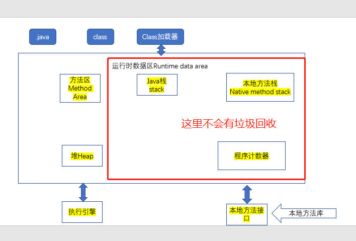
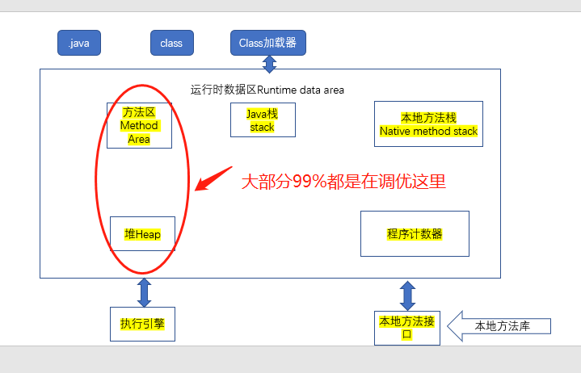

# JVM探究
- 请你谈谈对jvm的理解?
- java8虚拟机和之前的变化?
- 什么是OOM(内存溢出),什么是栈溢出StackOverFlowError?怎么分析
- JVM的常用调优参数有哪些?
- 内存快照如何抓取，怎么分析Dump文件?知道吗?
- 谈谈JVM中，类加载器你的认识?

1. JVM的位置
2. JVM的体系结构
3. 类加载器
4. 双亲委派机制
5. 沙箱安全机制
6. Native
7. PC寄存器
8. 方法区
9. 栈
10. 三种JVM
11. 堆
12. 新生区
13. 老年区
14. 永久区
15. 堆内存调优
16. GC
    - 常见算法
17. JMM
18. 总结

---
java执行顺序：
java>>>Class file>>> class类加载器>>>运行时数据区(Runtime Data Area)
分为方法区 java栈丶本地方法栈丶堆丶程序计算器丶(执行引擎，本地方法库->本地方法区)

---

---
调优的位置大致是这里

