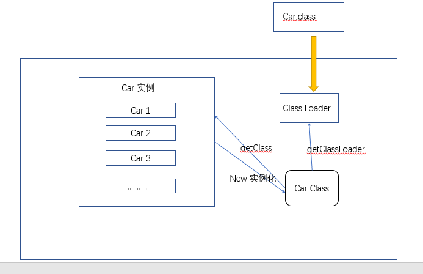

# JVM探究
- 请你谈谈对jvm的理解?
- java8虚拟机和之前的变化?
- 什么是OOM(内存溢出),什么是栈溢出StackOverFlowError?怎么分析
- JVM的常用调优参数有哪些?
- 内存快照如何抓取，怎么分析Dump文件?知道吗?
- 谈谈JVM中，类加载器你的认识?

1. JVM的位置
2. JVM的体系结构
3. 类加载器
4. 双亲委派机制
5. 沙箱安全机制
6. Native
7. PC寄存器
8. 方法区
9. 栈
10. 三种JVM
11. 堆
12. 新生区
13. 老年区
14. 永久区
15. 堆内存调优
16. GC
    - 常见算法
17. JMM
18. 总结

---
java执行顺序：
java>>>Class file>>> class类加载器>>>运行时数据区(Runtime Data Area)
分为方法区 java栈丶本地方法栈丶堆丶程序计算器丶(执行引擎，本地方法库->本地方法区)

---


---
调优的位置大致是这里


## 双亲委派机制：安全

```java
public class String {
    // 双亲委派机制;安全
    // 1.APP--> EXC ---> BOOT(最终执行)
    // BOOT,优先级最高
    // EXC，其次
    // APP，最后才轮到他去调用
    // null: java调用不到C, C++
}
```

1. 虚拟机自带的加载器
2. 启动类（根）加载器
3. 拓展类加载器
4. 应用程序（系统）加载器

## 沙箱安全机制
 组成沙箱的基本组件：
 1. 第一步：字节码校验，核心类是不用进行字节码校验；
 2. 类加载器。防止恶意代码去干涉善意的代码。
 - 从最内层JVM自带的类加载器加载，外层恶意代码无法修改加载顺序；

3. java中将执行程序分为本地代码和远程代码两种吗，本地代码默认是可信任的，而远程代码则不是受信任的

## 本地方法Native和方法区
```java
package com.wangjie;

public class NativeDemo {
    public static void main(String[] args) {
        new Thread(() -> {

        }, "my thread name").start();
    }
    // native: 凡是到了native关键字的，说明java的作用范围达不到了，回去调用C语言库
    // native：凡是进入native都会去本地方法库(JNI)java native interface 接口,扩展java的作用
    // JNI作用：扩展java的使用，融合不同的编程语言为java所用！最初：C，C++
    // Java诞生的时候 C,C++；必须要调用C和C++的程序~！
    // 内存区域中转么开辟了一块标记区域：Native method
    // Robot类，java程序驱动打印机
    private native void start0();

    // 调用其他接口; Socket , webservice,http;
    
}
```
### PC寄存器
程序计数器
每个线程都有一个程序计数器，是线程私有的，就是一个指针，指向方法区中的方法字节码（用来
存储指向像一条指令的地址，也即将要执行的指令代码），在执行引擎读取下一条指令，是一个非常小的内存空间，
几乎可以忽略不计

### 方法区
method area 方法区
方法区是被所有线程共享的，所有字段和方法字节码，以及一些特殊方法，如构造函数，接口代码也在此定义，简单说，所有定义的
方法的信息都是保存在该区域，此区域属于共享区间。

**静态变量丶常量丶类信息（构造方法丶接口定义）丶运行时的常量池存在方法区中，但是实例变量存在堆内存中，和方法区无关；**

static final, Class 常量池；


